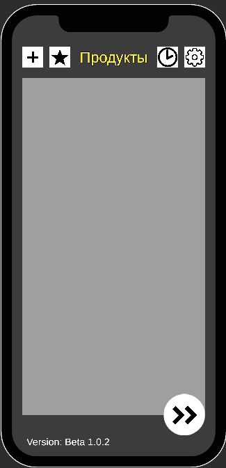

# NeedTo: Ваше приложение для списка покупок и дел

## Описание

Приложение для отслеживания списка покупок и дел.

p.s. В будующем планируется большое функций.

## Функции

### NeedToBuy

* Добавляйте товары в список.
* Отмечайте купленные товары.
* Удаляйте купленные товары из корзины.

### NeedToDo (в разработке)

* Добавляйте задачи в список.
* Назначайте задачи к определенному сроку.
* Отмечайте выполненные задачи.

## Установка

(руководство в разработке)

## Лицензия

Этот проект лицензирован под лицензией MIT - см. файл [LICENSE](/LICENSE) для получения дополнительной информации.

## Авторы

Изменения можно увидеть см. файл [UpdateLog](/UpdateLog)

## Авторы

[Autumn_Phos] - Разработчик